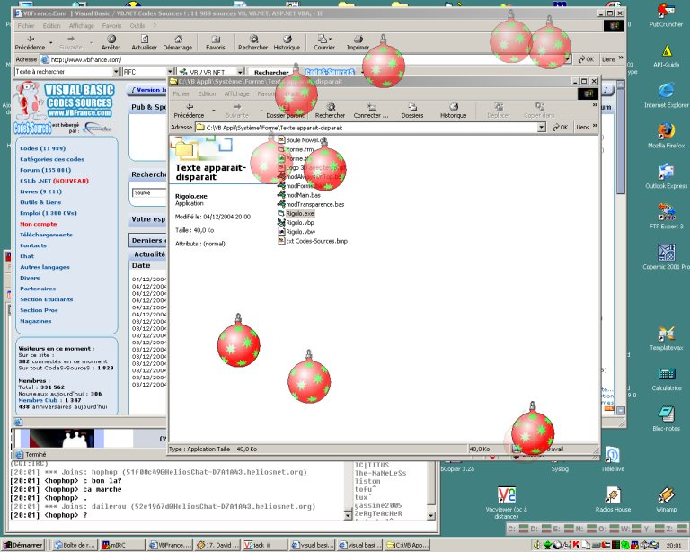



## Chrismass animation for your screen

### Description

Simply animate your screen with pictures appearing and disappearing smoothly.

It use Form design from image, transparencies effects.

Don't works on W95, W98, Millennium and NT windows versions.

Nota : Author and source comments are french
 
### More Info
 

             |
---                |---
**Submitted On**   |2004-12-03 02:13:42
**By**             |[The\_Jokez](https://github.com/Planet-Source-Code/PSCIndex/blob/master/ByAuthor/the-jokez.md)
**Level**          |Intermediate
**User Rating**    |5.0 (15 globes from 3 users)
**Compatibility**  |VB 6\.0
**Category**       |[Graphics](https://github.com/Planet-Source-Code/PSCIndex/blob/master/ByCategory/graphics__1-46.md)
**World**          |[Visual Basic](https://github.com/Planet-Source-Code/PSCIndex/blob/master/ByWorld/visual-basic.md)
**Archive File**   |[Chrismass\_1825331242004\.zip](https://github.com/Planet-Source-Code/the-jokez-chrismass-animation-for-your-screen__1-57547/archive/master.zip)

